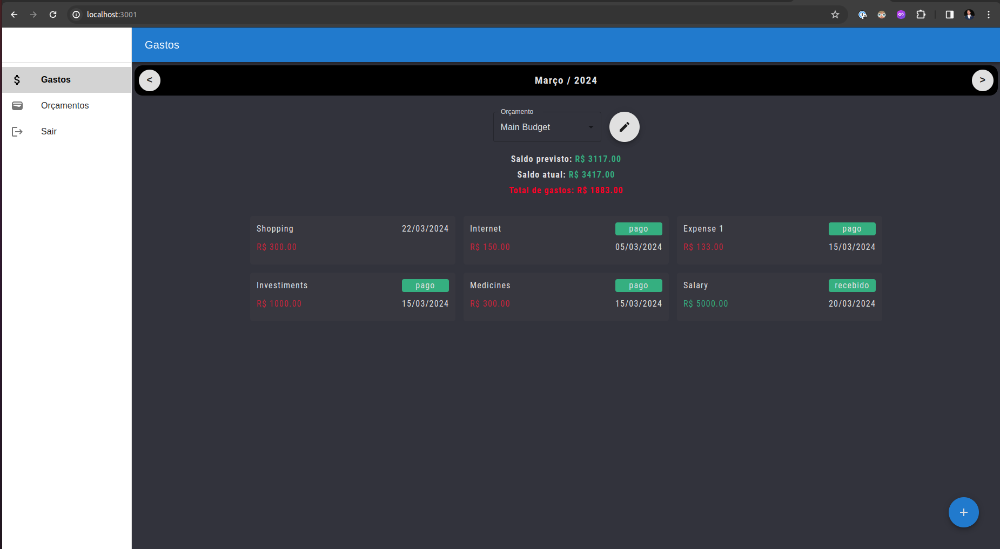
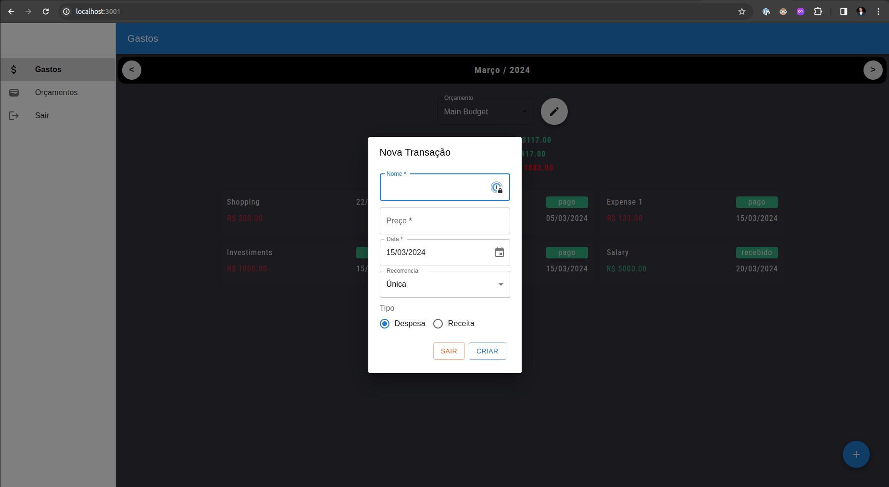
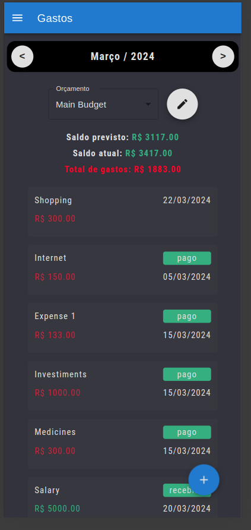
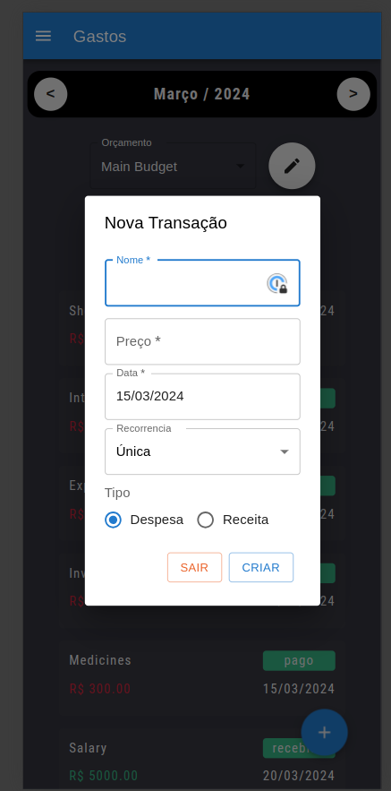
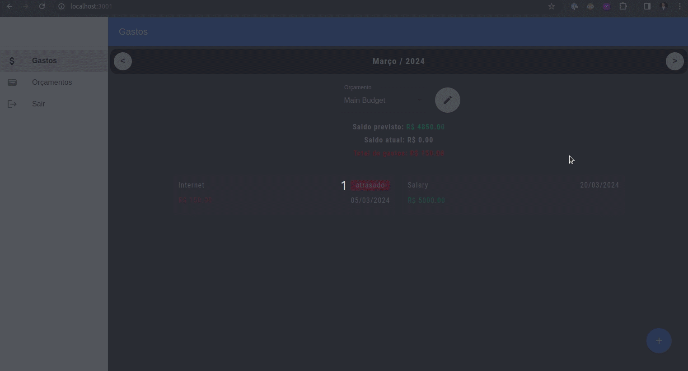

# CO Budget API
This is the API of a simple budgeting app that allows users to track their expenses and income.

## Main Features
- Users can create an account and log in.
- Users can create, read, update, and delete their budgets
- Users can create, read, update, and delete their budget's transactions (expenses and income)
  - Transactions can be once, installments, or recurring

## TODO
- [ ] Setup Docker for the project
- [ ] Allow users to invite other users to their budget

Stack:
- NextJS (Frontend)
- Ruby On Rails
- PostgreSQL
- RSpec
- Heroku
- Rubocop
- SimpleCov

## Setup
##### Prerequisites

The setups steps expect following tools installed on the system.

- Github
- Ruby [2.1.3]
- Rails [7.0.4]

##### 1. Check out the repository

```bash
git clone git@github.com:LucasHFS/co-budget-api.git
```

##### 2. Setup database.yml file

Edit the database configuration as required.

##### 3. Create and setup the database

Run the following commands to create and setup the database.

```ruby
bundle exec rake db:create
bundle exec rake db:setup
```

##### 4. Start the Rails server

You can start the rails server using the command given below.

```ruby
bundle exec rails s
```

## App Pages

### Home


### Mobile


## Small Demo

